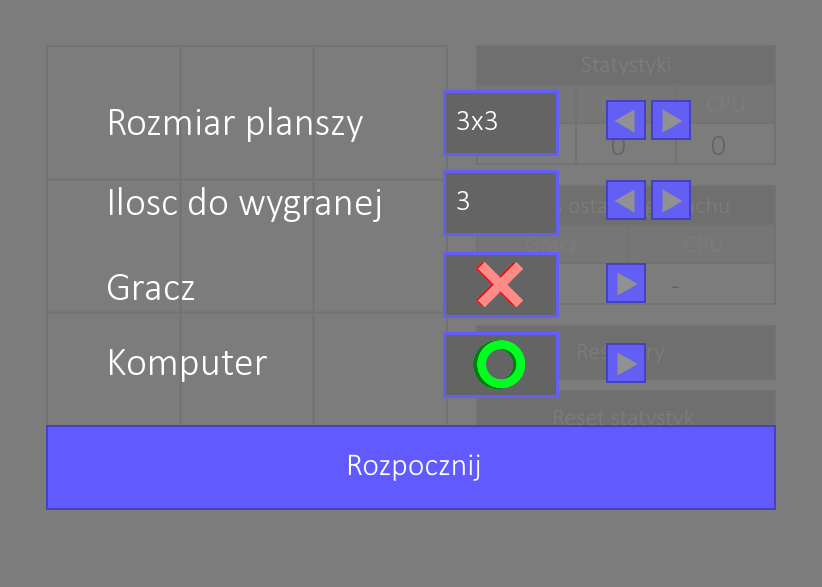
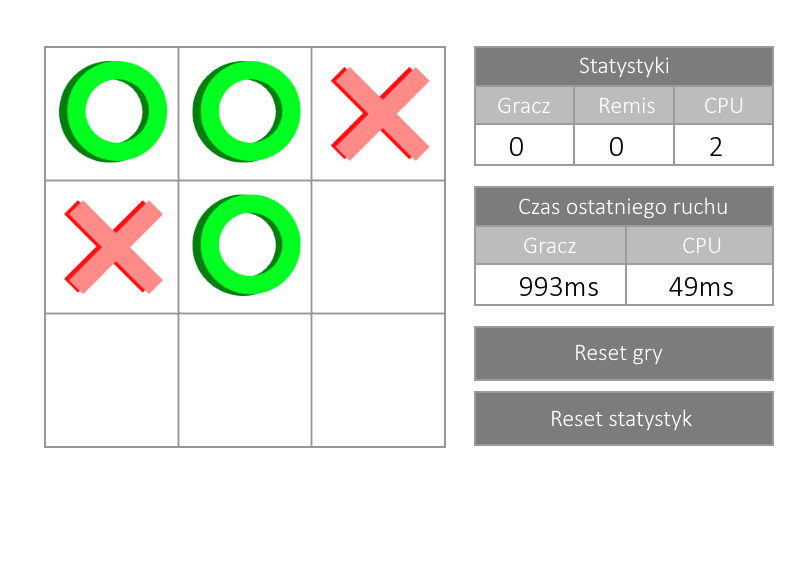

# Tic Tac Toe with AI

Simple plain tic tac toe game for one player. Player can play against unbeatable AI implemented using Min-Max algorithm with alpha-beta pruning. Application allows user to set non-standard 3x3 size of playing field
and the amount of symbols in a row needed to win. User can also pick whether he wants to play with _X_ or _O_.

## Screenshots

## How to use it?

### Requirements

* In order to build this application on your platform you need to have SFML installed (2.5.0 or newer version).

### Build

* Edit CMakeList.txt file, set SFML_DIR variable to path where you installed SFML library
* Create a build directory where you want executable file to be placed
* From inside this newly created directory use command 'cmake' with path to project root directory
* If your build system of choice is Makefile, also add '-G "Unix Makefiles"' argument
* Go to your build directory and build application with 'make' command (if your build system is Makefile)
* Executable file 'RobotNavigation.exe' will be created inside your build directory

Example:

'''
mkdir build
cd build
cmake .. -G "Unix Makefiles"
make
.\tic_tac_toe_AI.exe
'''

### Game statistics

* During game, on the right side of the application are displayed games statistics (player wind, draws, CPU wins) updated after each game.
* Below statistics table there is information about time needed to make a move for player and for CPU.
* You can reset game statistics any time by clicking _RESET STATISTICS_ button on the bottom.

